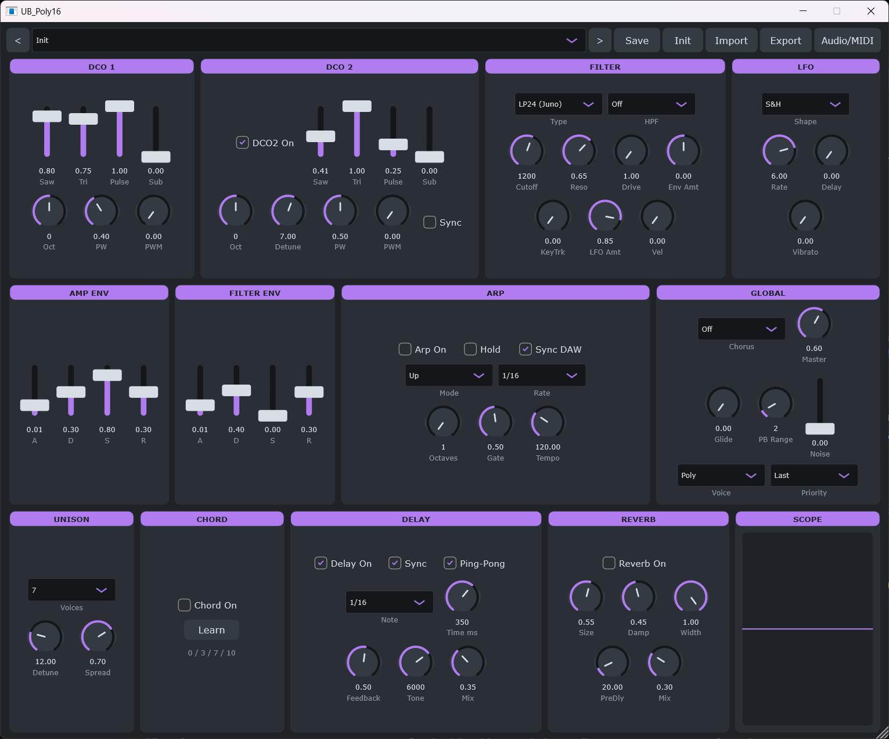

# UB_Poly16

**A 16-voice virtual-analog polysynth — a Juno-106 inspired instrument, augmented.**
VST3 + Standalone (Windows), built with [JUCE 8](https://juce.com).
A tribute by THE UNBoRN / [RetroVault](https://retrovault.be).



## Features

- **2 DCOs** per voice: polyBLEP saw & pulse (PW + PWM), triangle, sub-oscillator, noise
- **Hard sync** DCO1 → DCO2
- Juno-style non-resonant **HPF** (4 positions) + multimode **VCF**
  (LP/HP/BP, 12 & 24 dB/oct, drive), env / LFO / velocity / keytrack modulation
- 2 ADSR envelopes (amp + filter), LFO (tri/sine/saw/square/S&H) with delay
- **Unison** up to 7 voices, JP-8000-style detune curve with stereo spread
- **Voice modes**: Poly / Mono (retrigger + note memory) / Legato (single-trigger),
  with Last / Low / High note priority and cross-voice portamento
- **Chord memory** (learn a chord, play it with one key) and per-knob **MIDI Learn**
- Arpeggiator (5 modes, host-sync or internal tempo)
- Master FX: Juno-style chorus (I/II/I+II), tempo-synced stereo/ping-pong delay, reverb
- Oscilloscope, **89 factory presets** (including a "Legends" bank of classic-synth
  homages), user presets + bank import/export
- Resizable custom GUI

## Building (Windows)

Requirements: Visual Studio 2022 (or Build Tools) with the C++ workload and CMake,
plus a local [JUCE 8](https://github.com/juce-framework/JUCE) checkout.

```powershell
cmake -S . -B build -G "Visual Studio 17 2022" -A x64 -DUB_JUCE_DIR="C:/path/to/JUCE"
cmake --build build --config Release
```

Artifacts land in `build/UB_Poly16_artefacts/Release/` (`Standalone/UB_Poly16.exe`
and `VST3/UB_Poly16.vst3`). An Inno Setup script is provided in `installer/`.

### ASIO (optional, local builds only)

The Steinberg ASIO SDK is proprietary and **not redistributable**, so it is not
part of this repository and release binaries are built without ASIO. For a
personal build with ASIO support, download the SDK from Steinberg and configure:

```powershell
cmake -S . -B build -G "Visual Studio 17 2022" -A x64 `
    -DUB_JUCE_DIR="C:/path/to/JUCE" `
    -DUB_ASIO=ON -DUB_ASIO_SDK_DIR="C:/path/to/asiosdk/common"
```

See [THIRD_PARTY_LICENSES.md](THIRD_PARTY_LICENSES.md) for details.

## License

**GNU AGPLv3** — see [LICENSE](LICENSE). JUCE is used under its AGPLv3 option,
the VST3 SDK under its GPLv3 option. VST® is a registered trademark of
Steinberg Media Technologies GmbH.
